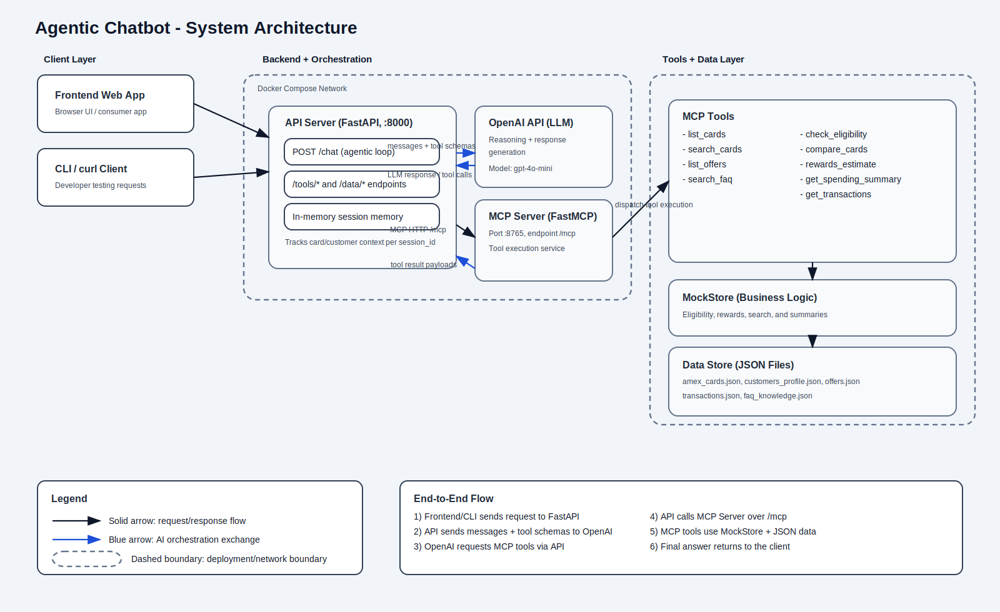

# Amex Agentic Chatbot (MCP + OpenAI)

A demo agentic chatbot for American Express card advisory, built with **FastAPI**, **FastMCP** (Model Context Protocol), and **OpenAI**. Users can ask natural-language questions about cards, offers, eligibility, rewards, and spending history. The LLM autonomously decides which tools to call at runtime — no hardcoded card knowledge, pure tool-use agents.

---

## Table of Contents

- [What This Project Does](#what-this-project-does)
- [Architecture](#architecture)
- [Project Structure](#project-structure)
- [Prerequisites](#prerequisites)
- [Getting Started](#getting-started)
  - [Option A: Docker (recommended)](#option-a-docker-recommended)
  - [Option B: Local (uv)](#option-b-local-uv)
- [Environment Variables](#environment-variables)
- [API Reference](#api-reference)
- [Example curl Commands](#example-curl-commands)
  - [Health Checks](#health-checks)
  - [Chat (Agentic)](#chat-agentic)
  - [Data Endpoints](#data-endpoints)
  - [Direct Tool Calls](#direct-tool-calls)
- [Available MCP Tools](#available-mcp-tools)
- [Mock Data](#mock-data)
- [Development](#development)

---

## What This Project Does

This project demonstrates the **Model Context Protocol (MCP)** agentic pattern:

1. A user sends a message to the **FastAPI** chat endpoint.
2. The API fetches the list of available MCP tools and injects them into an OpenAI chat completion request.
3. OpenAI decides which tools to call (zero, one, or many).
4. The API routes each tool call to the **FastMCP server**, which runs the actual business logic against mock JSON data.
5. Tool results are fed back into the conversation, and the loop repeats (up to 8 iterations) until the LLM produces a final natural-language answer.
6. The answer, along with which tools were used, is returned to the caller.

The LLM has **no hardcoded knowledge** about cards, fees, or eligibility rules — it discovers all of this dynamically by calling tools. Session memory (last referenced card, customer, spending context) is maintained per `session_id` in-process.

---

## Architecture

This project architecture is documented in the diagram below:



### Component Breakdown

| Component | Tech | Port | Responsibility |
|---|---|---|---|
| **API Server** | FastAPI + uvicorn | `8000` | Receive user requests, manage OpenAI conversation, route tool calls, maintain session state |
| **MCP Server** | FastMCP | `8765` | Expose domain tools over MCP Streamable HTTP protocol |
| **MockStore** | Python dataclass | — | Business logic: search, eligibility rules, rewards calculation, spending lookups |
| **OpenAI** | `gpt-4o-mini` (default) | External | LLM reasoning: understand intent, decide which tools to call, generate final response |
| **Session Store** | In-memory dict | — | Track conversation history and context per `session_id` |
| **JSON Data Files** | Static files | — | Mock cards, customers, transactions, offers, FAQ knowledge base |

---

## Project Structure

```
mcp-chatbot-amex/
├── apps/api/
│   ├── main.py                  # FastAPI app entrypoint
│   ├── mcp_client.py            # MCP client (Streamable HTTP)
│   ├── models.py                # Pydantic request/response models
│   ├── prompts/
│   │   └── system-prompt.md     # LLM system prompt
│   └── routers/
│       ├── chat.py              # Chat endpoint + agentic loop
│       ├── data.py              # Raw data access endpoints
│       └── tools.py             # Direct tool call endpoints
├── mcp_mock/
│   ├── server.py                # FastMCP server (tool definitions)
│   ├── resources/               # Card, customer, offer resources
│   └── tools/                   # Tool implementations
│       ├── compare.py
│       ├── eligibility.py
│       ├── product_search.py
│       └── rewards.py
├── src/amex_core/
│   ├── data/                    # Mock JSON data files
│   │   ├── amex_cards.json      # 5 Amex card products
│   │   ├── customers_profile.json  # 3 demo customer profiles
│   │   ├── offers.json          # Current offers and promotions
│   │   ├── transactions.json    # ~50 sample transactions
│   │   ├── faq_knowledge.json   # FAQ knowledge base
│   │   └── spending_categories.json
│   ├── services/mock_store.py   # Business logic layer
│   └── settings.py              # Pydantic settings (env vars)
├── scripts/test_mcp.py          # Smoke-test script
├── Dockerfile.api
├── Dockerfile.mcp
├── docker-compose.yml
├── pyproject.toml
└── .env.example
```

---

## Prerequisites

- **Docker & Docker Compose** (for the recommended Docker setup)
- **Python 3.12+** and **[uv](https://docs.astral.sh/uv/)** (for local setup)
- An **OpenAI API key** (`gpt-4o-mini` by default, or any chat model)

---

## Getting Started

### Option A: Docker (recommended)

**1. Clone the repo**

```bash
git clone <repo-url>
cd mcp-chatbot-amex
```

**2. Create your `.env` file**

```bash
cp .env.example .env
```

Edit `.env` and set your OpenAI API key (see [Environment Variables](#environment-variables) below).

**3. Start all services**

```bash
docker compose up --build
```

Docker Compose will:
- Build and start the **MCP server** (port `8765`) first
- Wait for the MCP server to pass its health check
- Build and start the **API server** (port `8000`)

**4. Verify both services are running**

```bash
curl http://localhost:8000/health
curl http://localhost:8765/health
```

Both should return `{"ok": true}`.

---

### Option B: Local (uv)

**1. Install uv** (if not already installed)

```bash
curl -LsSf https://astral.sh/uv/install.sh | sh
```

**2. Install dependencies**

```bash
uv sync
```

**3. Set up environment**

```bash
cp .env.example .env
# Edit .env with your OpenAI API key
```

**4. Start the MCP server** (in one terminal)

```bash
uv run mcp-mock
```

The MCP server will start on `http://localhost:8765`.

**5. Start the API server** (in another terminal)

```bash
# Update MCP_SERVER_URL in .env to point to localhost
# MCP_SERVER_URL=http://localhost:8765/mcp

uv run api
```

The API server will start on `http://localhost:8000`.

---

## Environment Variables

| Variable | Default | Description |
|---|---|---|
| `OPENAI_API_KEY` | _(required)_ | Your OpenAI API key |
| `OPENAI_MODEL` | `gpt-4o-mini` | OpenAI model to use for chat |
| `MCP_SERVER_URL` | `http://mcp:8765/mcp` | URL to the MCP server (`http://localhost:8765/mcp` for local) |
| `API_HOST` | `0.0.0.0` | API server bind host |
| `API_PORT` | `8000` | API server bind port |
| `API_CORS_ORIGINS` | `*` | Comma-separated allowed CORS origins |
| `MCP_HOST` | `0.0.0.0` | MCP server bind host |
| `MCP_PORT` | `8765` | MCP server bind port |
| `MCP_SERVER_NAME` | `amex-mock-mcp` | FastMCP server display name |

**Minimal `.env` to get started:**

```env
OPENAI_API_KEY=sk-proj-your-key-here
OPENAI_MODEL=gpt-4o-mini
MCP_SERVER_URL=http://mcp:8765/mcp
```

---

## API Reference

### API Server (port 8000)

| Method | Path | Description |
|---|---|---|
| `GET` | `/health` | Health check |
| `POST` | `/chat` | Main agentic chat endpoint |
| `GET` | `/chat/history` | Retrieve conversation history for a session |
| `POST` | `/chat/clear` | Clear session memory and history |
| `GET` | `/data/cards` | List all mock cards |
| `GET` | `/data/offers` | List all mock offers |
| `GET` | `/data/customers` | List all mock customers |
| `GET` | `/tools` | List available MCP tools |
| `POST` | `/tools/search` | Direct card search (bypasses LLM) |
| `POST` | `/tools/eligibility` | Direct eligibility check |
| `POST` | `/tools/rewards` | Direct rewards estimate |
| `POST` | `/tools/compare` | Direct card comparison |

### MCP Server (port 8765)

| Method | Path | Description |
|---|---|---|
| `GET` | `/health` | MCP server health check |
| `POST` | `/mcp` | MCP Streamable HTTP protocol (tool calls) |

---

## Example curl Commands

### Health Checks

```bash
# API server health
curl http://localhost:8000/health

# MCP server health
curl http://localhost:8765/health
```

---

### Chat (Agentic)

The `/chat` endpoint is the main entry point. The LLM will automatically call whichever MCP tools it needs to answer your question.

**Basic card question:**
```bash
curl -s -X POST http://localhost:8000/chat \
  -H "Content-Type: application/json" \
  -d '{"message": "What Amex cards do you offer?"}' | jq
```

**Annual fee lookup:**
```bash
curl -s -X POST http://localhost:8000/chat \
  -H "Content-Type: application/json" \
  -d '{"message": "What is the annual fee for the Platinum card?"}' | jq
```

**Card recommendation with spending context:**
```bash
curl -s -X POST http://localhost:8000/chat \
  -H "Content-Type: application/json" \
  -d '{
    "message": "I spend a lot on dining and travel. Which card should I get?",
    "session_id": "user-session-001"
  }' | jq
```

**Eligibility check (with customer ID):**
```bash
curl -s -X POST http://localhost:8000/chat \
  -H "Content-Type: application/json" \
  -d '{
    "message": "Am I eligible for the Platinum card?",
    "session_id": "user-session-001",
    "customer_id": "demo_user_1"
  }' | jq
```

**Rewards estimate:**
```bash
curl -s -X POST http://localhost:8000/chat \
  -H "Content-Type: application/json" \
  -d '{
    "message": "How many points would I earn if I spend $3000 a month on the Gold card?",
    "session_id": "user-session-001"
  }' | jq
```

**Card comparison:**
```bash
curl -s -X POST http://localhost:8000/chat \
  -H "Content-Type: application/json" \
  -d '{
    "message": "Compare the Gold card and the Platinum card for me",
    "session_id": "user-session-001"
  }' | jq
```

**Spending summary:**
```bash
curl -s -X POST http://localhost:8000/chat \
  -H "Content-Type: application/json" \
  -d '{
    "message": "Show me my spending summary for last month",
    "session_id": "user-session-001",
    "customer_id": "demo_user_1"
  }' | jq
```

**Multi-turn conversation** (same `session_id` retains context):
```bash
# Turn 1: establish context
curl -s -X POST http://localhost:8000/chat \
  -H "Content-Type: application/json" \
  -d '{"message": "Tell me about the Gold card", "session_id": "my-session"}' | jq

# Turn 2: follow-up question (agent remembers previous context)
curl -s -X POST http://localhost:8000/chat \
  -H "Content-Type: application/json" \
  -d '{"message": "What dining benefits does it have?", "session_id": "my-session"}' | jq
```

**Retrieve conversation history:**
```bash
curl -s "http://localhost:8000/chat/history?session_id=my-session" | jq
```

**Clear session:**
```bash
curl -s -X POST "http://localhost:8000/chat/clear?session_id=my-session" | jq
```

---

### Data Endpoints

Browse the raw mock data without going through the LLM:

```bash
# All cards
curl -s http://localhost:8000/data/cards | jq

# All offers and promotions
curl -s http://localhost:8000/data/offers | jq

# All demo customers
curl -s http://localhost:8000/data/customers | jq
```

---

### Direct Tool Calls

Call MCP tools directly, bypassing the LLM entirely. Useful for testing or building your own frontend:

**List available tools:**
```bash
curl -s http://localhost:8000/tools | jq
```

**Search cards by keyword:**
```bash
curl -s -X POST http://localhost:8000/tools/search \
  -H "Content-Type: application/json" \
  -d '{"query": "travel rewards"}' | jq
```

**Check eligibility:**
```bash
curl -s -X POST http://localhost:8000/tools/eligibility \
  -H "Content-Type: application/json" \
  -d '{
    "customer_id": "demo_user_1",
    "card_id": "platinum"
  }' | jq
```

**Estimate rewards:**
```bash
curl -s -X POST http://localhost:8000/tools/rewards \
  -H "Content-Type: application/json" \
  -d '{
    "card_id": "gold",
    "monthly_spend_inr": 50000
  }' | jq
```

**Compare cards:**
```bash
curl -s -X POST http://localhost:8000/tools/compare \
  -H "Content-Type: application/json" \
  -d '{"card_ids": ["gold", "platinum"]}' | jq
```

---

## Available MCP Tools

These tools are registered on the MCP server and are automatically available to the LLM during chat:

| Tool | Parameters | What it does |
|---|---|---|
| `list_cards` | — | Returns all available card products |
| `list_offers` | — | Returns all current offers and promotions |
| `search_cards` | `query: str` | Text search across card names, types, rewards, and benefits |
| `search_faq` | `question: str` | Keyword-scored FAQ search, returns top 5 matches |
| `check_eligibility` | `customer_id: str`, `card_id: str` | Mock eligibility check (credit score + income rules) |
| `compare_cards` | `card_ids: list[str]` | Returns full card data for the given card IDs |
| `rewards_estimate` | `monthly_spend_inr: int`, `card_id: str` | Estimates monthly rewards points |
| `get_spending_summary` | `customer_id: str`, `month: str` | Category-by-category spending breakdown |
| `get_transactions` | `customer_id: str`, `month: str`, `category: str` | Individual transactions, optionally filtered by category |

**Month format** for spending/transaction tools: `"YYYY-MM"`, `"last_month"`, `"this_month"`, or `"previous_month"`.

**Eligibility rules (mock):**
- `platinum`: credit score ≥ 700 and annual income ≥ $75,000
- `gold`: credit score ≥ 650 and annual income ≥ $50,000

---

## Mock Data

The project ships with realistic mock data (no real customer data is used):

**Cards** (`amex_cards.json`) — 5 products:
- `platinum` — The Platinum Card® ($695/year, 5x travel, lounge access)
- `gold` — Gold Card® ($250/year, 4x dining and groceries)
- `green` — Green Card® ($150/year, 3x travel, transit, dining)
- `business_platinum` — Business Platinum Card® ($695/year, 5x flights/hotels)
- `blue_cash_preferred` — Blue Cash Preferred® ($95/year, 6% groceries, 3% streaming)

**Demo Customers** (`customers_profile.json`) — 3 profiles:
- `demo_user_1` — Sarah Johnson (credit score 720, income $85k, frequent traveler)
- `demo_user_2` — Michael Chen (credit score 680, income $62k, urban professional)
- `demo_user_3` — Jennifer Williams (credit score 750, income $120k, business owner)

**Transactions** — ~50 sample transactions from Jan–Mar 2026 across travel, dining, groceries, shopping, and more.

---

## Development

**Run linter:**
```bash
uv run ruff check .
uv run ruff format .
```

**Run type checker:**
```bash
uv run mypy .
```

**Run tests:**
```bash
uv run pytest
```

**Smoke-test the MCP server directly:**
```bash
uv run python scripts/test_mcp.py
```

**Rebuild Docker images after code changes:**
```bash
docker compose up --build
```

---

## Chat Request/Response Schema

**Request body for `POST /chat`:**
```json
{
  "message": "Which card is best for dining?",
  "session_id": "optional-unique-session-id",
  "customer_id": "optional-demo-customer-id"
}
```

**Response:**
```json
{
  "reply": "Based on your dining focus, the Gold Card® is your best option...",
  "tools_used": ["search_cards", "list_offers"],
  "suggestions": []
}
```

`tools_used` tells you exactly which MCP tools the LLM invoked to answer the question.
